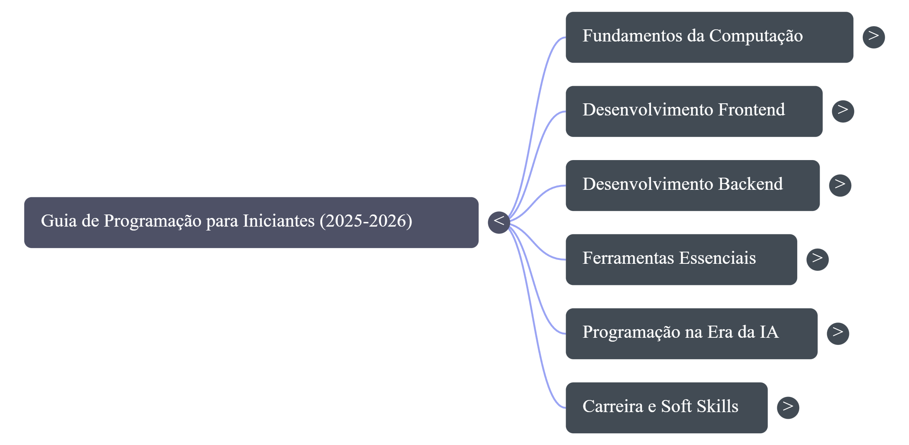
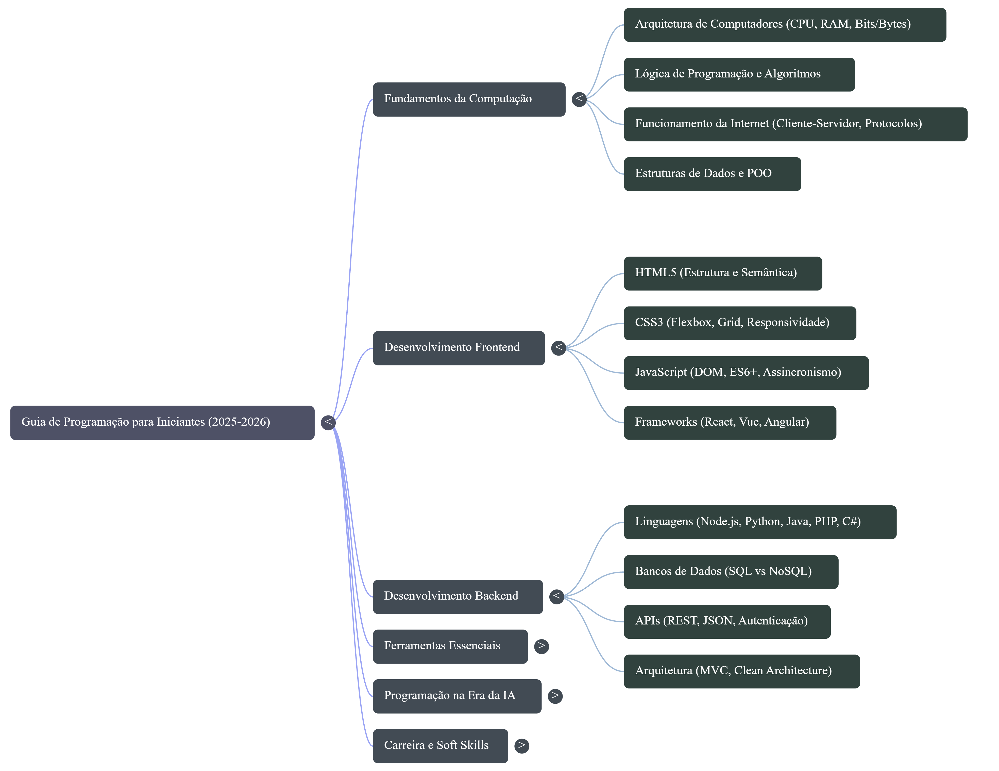
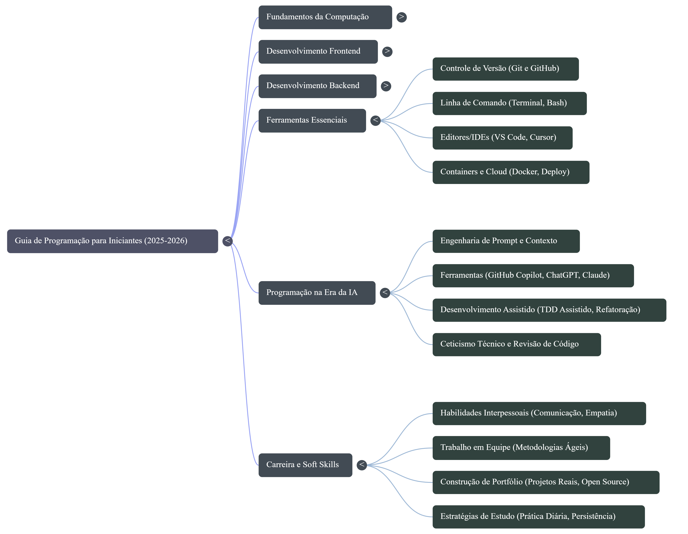

# 🚀 Dev Junior Roadmap with AI

Este projeto apresenta um **mapa de estudos prático para se tornar um desenvolvedor júnior**, utilizando Inteligência Artificial como ferramenta de apoio no aprendizado.

A proposta é organizar conteúdos, estruturar o conhecimento e demonstrar, na prática, como a IA pode ser utilizada para acelerar o desenvolvimento técnico e estratégico na área de programação.

---

## 🎯 Objetivo

Criar um sistema de aprendizado que permita:

- Evoluir do nível iniciante até desenvolvedor júnior
- Estruturar estudos com base em fontes confiáveis
- Utilizar IA como apoio na aprendizagem ativa
- Consolidar conhecimento através de resumos, mapas e planos práticos

---

## 🧠 Acesse o NotebookLM

👉 **Link do projeto interativo:**  
https://notebooklm.google.com/notebook/bf3757db-32ae-4916-881d-882843317fa5

No notebook você encontrará:
- Fontes selecionadas
- Resumos estruturados
- Interação com IA baseada no conteúdo
- Mapa mental e materiais complementares

---

## 📚 Curadoria de Fontes

Foram selecionadas **28 fontes estratégicas**, incluindo:

- Documentações oficiais (MDN)
- Guias completos (freeCodeCamp)
- Roadmaps (frontend, backend e geral)
- Cursos práticos (Fullstack Open, Python MOOC)
- Conteúdos sobre mercado e carreira

A curadoria priorizou:
- Qualidade sobre quantidade
- Conteúdo atualizado
- Aplicação prática

---

## 🧠 Engenharia de Prompts

Durante o desenvolvimento, foram utilizados prompts estratégicos para extrair o máximo da IA.

### Exemplos:

- Criar roadmap completo para dev júnior  
- Transformar aprendizado em plano de 90 dias  
- Listar erros comuns e como evitá-los  
- Estruturar conhecimento em níveis (iniciante → júnior)  
- Refinar respostas para formato profissional  

👉 Isso permitiu transformar informação em **conhecimento estruturado e aplicável**.

---

## ⚠️ Cicatrizes (Aprendizados)

Durante o processo, alguns pontos importantes ficaram claros:

- Assistir conteúdo não é aprender → prática é essencial  
- Pular fundamentos atrasa a evolução  
- Copiar código não desenvolve habilidade  
- Focar em uma stack é mais eficiente que tentar aprender tudo  
- Saber pesquisar é uma das habilidades mais importantes  

---

## 🧠 Mapa Mental do Roadmap

O conhecimento foi consolidado em um mapa mental visual:

Esse mapa organiza:
- Fundamentos
- Frontend e Backend
- Ferramentas essenciais
- Mercado e soft skills

---

## 📊 Apresentação (Slides)

Também foi criada uma apresentação para facilitar a visualização do roadmap, explicando conceitos e estratégia de evolução.

📄 **Slides:**  
📥 [Baixar Slides em PDF](./assets/slides-dev-junior-roadmap.pdf)

Conteúdo dos slides:
- Jornada do desenvolvedor
- Diferença entre frontend e backend
- Roadmap prático
- Erros comuns
- Plano de evolução

---

## 📌 Miniguia Final

### 🧭 Etapas da jornada
- Iniciante → Lógica, HTML, CSS, JS
- Intermediário → APIs, Banco de dados, Git
- Mercado → Deploy, Projetos, Portfólio

---

### 🧠 Habilidades essenciais
- Lógica de programação  
- Git e GitHub  
- APIs e HTTP  
- Banco de dados  
- Desenvolvimento de projetos  

---

### ⚠️ Erros a evitar
- Tutorial infinito  
- Pular fundamentos  
- Copiar código  
- Estudar tudo ao mesmo tempo  

---

### 🚀 Plano prático
- Estudar 1–2h por dia  
- Construir projetos reais  
- Montar portfólio no GitHub  

---

### 🎯 Objetivo final
- Conseguir a primeira vaga como desenvolvedor júnior  
- Ter um portfólio com projetos reais  
- Ser capaz de construir aplicações completas  

---

## 🏆 Conclusão

Este projeto demonstra não apenas o aprendizado técnico, mas também:

- Capacidade de organização  
- Pensamento estratégico  
- Uso prático de IA  
- Autonomia no aprendizado  

Mais do que um guia, este é um **sistema de evolução contínua** para quem deseja ingressar na área de desenvolvimento.

---

## 📌 Autor

**Bryan Duarte**  
